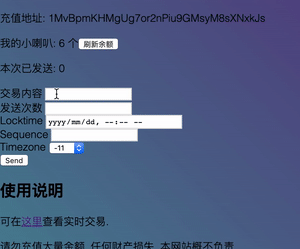

# 无法集中的精力

下午好，这里是ljzn。

我越来越无法集中精力长时间做一件事情了。即使是在编程的时候，明确地直到要完成什么目标，但只要中间步骤有一点点的疑问，我就无法集中，忍不住打开网页去看一些无关紧要的内容。或者是迷失在超链接里。

微博，推特这种碎片化的信息灌输，已经让我适应并且非常享受这种被快速打断的感觉。让我觉得非常疼痛的是 -- 做完一件事情几乎是不可能的了。这又能怪谁呢，只怪我自己的意志力太渺小。在写这些文字的时候，我其实正在做其它几件事情，但我不得不停下来，转移到另外一件事情上，好像是一种强迫行为。其实也没有那么糟糕啦，来回切换并不会让我觉得疲惫，而是非常放松。

写完上面这段，又去写了十几分钟的代码，然后又卡住了。卡住的原因是我花了很长的时间还没能将写出来的代码跑起来，因为需要在测试代码中做很多的准备工作，各种参数要先存进数据库，然后才能跑起测试代码。这种因为测试的繁琐步骤而导致不能很快看到，或者预测到，代码的结果，往往是让人恼怒的。我把这种情况的出现归咎与没有明显的抽象分层。但要设计出好的抽象又是十分不易的，多层的抽象，首先要保证底层是稳定且灵活且简单的。

> 编程是在不停地构造抽象以及打破抽象。

我加上了引文格式以使这句话看起来更有道理。

> 人类可掌控的时间维度太短暂了。

我的注意力保持限度是5分钟左右，我的笔记本电脑的可靠运行时间取决于它的电池剩余电量，一个网站的可靠时间取决于网站背后的程序员以及程序员背后的老板。一开始减少依赖被认为是一种提高稳定性的可行方法，然而不依赖别人即是依赖自己，自己是否比别人更可靠呢，未必。所以问题不在于依赖的数量，而是质量。

奇怪的内容扯的太多了。回到我们的时光机项目上来吧。

之前我们提到了使用 locktime 来延迟交易的生效时间：

> 第二步, 需要在我们指定的未来某一时刻把消息释放出来. 这个用比特币的 locktime 就能做到. 这里我们用 LT 表示解锁的最早时间.

实际上，还需要设置参数 `sequence`。在普通的比特币交易中，它通常被设置成最大值，表示交易的版本已经确定，不会再更改。所以如果 `sequence` 的值是最大值，那么`locktime`就会失效，因为这笔交易已经不能再被更改，而 `locktime` 的含义是在某个时间之间，交易都可以被更新。如果先发出了一笔`sequence` 为 n 的交易，之后要对其更新的话，必须是在交易生效之前，即 `locktime` 到达之前。且新的交易的 `sequence` 需要大于 n。

我们用 MNode 生成了一笔带有 locktime 参数的交易，故意将到期时间设置在1年后。这笔交易可以通过 MerchantAPI 发出，但是很可能会被矿工 Drop 掉，因为等到矿工可以获得这笔交易中手续费，需要保存太久了。而且这种未确定的交易不会显示在区块浏览器上。



这笔交易的原文是： 

```
01000000011d1ba2c39a22a0189f20bbd0b30e5d19afd45297868a6aae070316666b9dae5b150000006a473044022029d091f0d41237ab7b278400ad55486588fc9b1d040d5ee302289fb39425ab100220152e55c613ce11bdba00dcbd7d4c3155139c3c69866e44dd07dcb410f9379be3412103ff9c9ef81556963d13360f5b840703574f48302ba7b62b7e002aa22a688ce33a0100000002000000000000000024006a21e8bf99e698afe697a0e6b395e58f91e587bae79a84e5ae9ae697b6e4baa4e6989371030000000000001976a9149eb611d9dcd664f7fae0bb7367549e0dde90bf8888ac94fece61
```

之后我们会把这个原文包含在另外一笔交易中，这样就不会丢失了。