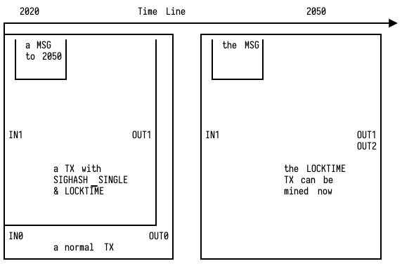

# 靠谱的时光机

准备写个时光机. 限于物理学, 只能做到单向穿梭 ---- 现在到未来.

第一步, 需要有锁定现在时间的能力. 这个用区块链很容易就做到了. 发一笔交易, 打上时间戳. 这里我们用 `M` 表示信息, `TX1` 表示包裹着这一信息的交易, `TS` 表示与交易被打包的时间戳.

```erl
TX1 = tx(M, TS)
```

第二步, 需要在我们指定的未来某一时刻把消息释放出来. 这个用比特币的 `locktime` 就能做到. 这里我们用 `LT` 表示解锁的最早时间.

```erl
TX2 = lock(M, LT)
```

所以, 第一步里面的 `M` 应当用第二步里的 `TX2` 替换, 以保证消息是被锁定的.

```erl
TX1 = tx(TX2, TS)
    = tx(lock(M, LT), TS)
```

第三步, 需要引入经济激励, 这样哪天我们的网站到了, 应用挂了, 人走了, 也不怕消息会石沉大海销声匿迹. 这个用比特币签名算法里的 sighash type 里的 `SIGHASH_SINGLE` 就可以实现. 只要确保我们的消息作为交易的其中一个输出, 其它的输出可以由帮我们发出交易的人自由分配. 这样发交易就会变成一项有利可图的工作. 这里用 `V` 表示消息中包含的奖励.

```erl
TX3 = gild(M, V)
```

所以, 用第三步的 `TX3` 替换掉第二步里的 `M`, 以附加上奖励.

```erl
TX1 = tx(lock(M, LT), TS)
    = tx(lock(gild(M, V), TS))
```

至此, 我们就得到一条可以自动单向穿梭时间的消息.

用图画表示可能会直观一些


