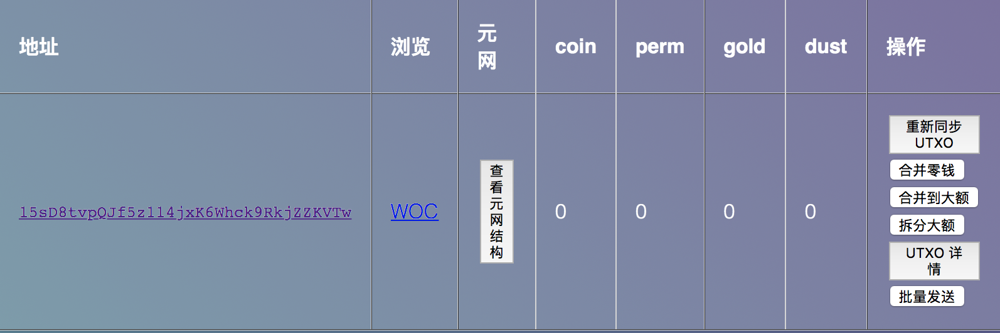

# 缓慢推进的时间旅行

下午好， 这里是LJZN。

最近刚看完了 Ayn Rand 的《源泉》，意犹未尽，厚厚的一本书直到倒数第二节主角在法庭上慷慨成词，才开始说理。故事里很大的一个冲突的地方是主角在作为采石场的工人的时候强奸了女主角，但女主角没有报警，而是爱上了主角。这个不是特别理解。

前天到书店本来想买几本琴谱，因为前段时间在家太无聊于是买了一台电钢琴，瞎弹。结果书店看了半天只看到一本吉他民歌，晕。最后买了本很多人推荐的《卡拉马佐夫兄弟》。

还记得我们上次提到的 “靠谱的时光机” 吗。今天正好没什么事，就尝试推进一下进度好了。

# MNode

[MNode](https://github.com/Ljzn/MNode) 是一个包含了一些 UTXO 管理功能的开源钱包，它的界面很简陋，文档和代码都很糟。优点是勉强能用。还有一个缺点是需要安装 erlang, postgreSQL, nodejs. 在俺的 MacBook Pro 上安装个 erlang 风扇呼呼地转。装完之后发现忘了装 OpenSSL，加密模块没法用T_T。各种依赖多了有利有弊，更成熟的依赖可以提供稳定丰富的功能，但同时也增加了部署的负担。

还是聊聊最近的比特币减半吧。风平浪静什么事情也没有发生，之前说的什么砸盘，冰山合约，Segwit漏洞，一点都没有。听说有的矿池不让用户关机，亏本挖，不知道真的假的。

说到假消息，推特上的假消息是最多的。现在传统的新闻媒体也不能信了，比如 Fobers，经常在各种的币圈项目的网页上看到，什么被 Fobers 报道了，实际上可能只是被 Fobers 上的自媒体作者写了一下而已，并不需有记者的身份。说回推特，今天看到推特的 CEO 说员工可以在疫情结束后继续远程办公。这个我举双手双脚赞成。尤其是大城市房价这么贵，在公司办公基本上就决定了和家人聚少离多。实际上工作效率并没有因为在公司办公而提高多少。

代码托管是在加班办公必须解决的问题，有的公司自己搭建的 SVN，gitlab 之类的，要让外网访问就比较麻烦。好的公司一开始就用 github ，在家办公完全无压力。微软收购 Github 之后，接连推出了好些新功能，据传将在 repo 里面加入 community 功能，有从代码管理平台向开发社区平台扩张的趋势。

由 Nodejs 之父主导的 Deno 终于推出 1.0 版本了。其中被宣传很多的一个点就是类似 Go 的 URL 包管理。导入本地的包，部署私有的包管理服务器，都会方便很多。一直以来我有个想法，把包放到区块链上，然后用 txid 来导入，程序内置 SPV 验证，保证代码是未被篡改的。别的不说，安全性远超各种 CDN。实现起来也不难。

有时候想想，现在的网络世界真是危机四伏。各种服务高度依赖，在获得便利的同时也增加了安全隐患，一个服务被黑，可能会殃及很多其他的服务。如果说不再依赖外部服务，相当于自断手足了，边际成本是不可接受的。比特币是一个解决方案，通过强中心化实现去中心化，最主要的目标还是安全。

我提到 SPV 了？ SPV 是 Simple Payment Verify, 通过 “部分默克尔树“ PMT 来验证交易是否存在与某个区块中，同时与多个节点同步区块头，保持跟随最长链，从而防止被虚假信息欺骗。

在 MNode 里有一个简易的 [PMT 验证实现](https://github.com/Ljzn/MNode/blob/master/lib/bex_lib/pmt.ex)，代码不到100行。验证是简单，可是没数据啊。MerkleProof 的计算需要整个区块里全部的 TXID，在区块越来越大的趋势下，只有矿工才会保存全部的 TXID，所以这个服务只能是由矿工来提供。据说 BSV 节点团队正在开发一个底层的消息传输系统，以解决离线交流的问题。最终会在 Merchant API 里面提供 Merkle proof 的回调，以及双花报警。但愿老外的开发速度能快点把。

想起来 MNode 里面也实现了一个[计算 Merkle 的服务](https://github.com/Ljzn/MNode/blob/master/lib/bex/store/merkle_saver.ex)，从区块浏览器的接口拉取 TXID 然后计算。最后这个东西不了了之了，存储成本太高。这事儿还是只能财大气粗的矿工来做。

俺一直想把 bitcoind 的 zeromq 接口用起来，使用 bitcoind 做一个实时的消息通道。今天闲着的时候到 zeromq 的网站上学习了一番，顺被帮他们补了一下 [erlang 的例子](https://zeromq.org/get-started/?language=erlang&library=chumak#)。

# Bitcoin-Cli

在电脑上把 Bitcoind 用 docker 跑了起来，顺便写了一个[命令行的RPC客户端](https://github.com/Ljzn/bitcoin-cli-bash)。

写了这么多，发现时间旅行的计划完全没有进展。。。刚扫了一眼 https://bitcoinblocks.live ，发现 TPS 稳定在 20 以上了，真是厉害啊这些应用开发者,怎么能制造出这么多交易的。转念一想，未来数据不上链寸步难行，全人类每天制造的交易都会上链，现在这些交易简直是沧海一粟了。

终于安装好了各种依赖，把 MNode 跑起来了。

