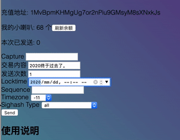

# 宇宙指针

早上好, 这里是 LJZN.

最近好消息多,坏消息也多. 振奋人心的消息是 SpaceX 的龙飞船成功把两名航天员送上了国际空间站. 人往高处走, 水往低处流. 马斯克可能是地球上走得最高的人了. 高, BitcoinSV 最近的交易体积也是相当高, 昨天有位开发者接连制造了两笔交易, 一笔 8MB,一笔 10MB, 第二笔是那张著名的哈勃望远镜拍摄的宇宙图景. 两笔交易都被矿工接受并打包进区块了. 第二笔交易大约花了 10 美元的手续费. 这手续费也算是相当高了, 现在的网盘都提供十几 G 的免费空间, 何必花 10 美元上传一张 10MB 的图片到 BitcoinSV 区块链上呢?

实验意义远大于实用意义. 回顾 2017, 2018 年, 各个派别还在为区块大小这个问题吵得不可开交, 有的说比特币协议不能支持超过 1MB 的区块, 有的说 8MB 可以, 还有的说的 32MB 不能再多了. nChain 说, 比特币协议可以无限扩容, 区块没有上限, 第一步先提高到 2 个 G. 这一下子就把比特币从奢侈品 LV 包包变成了可口可乐, 人人用得起, 人人有功练. 交易手续费也在逐步降低, 开始是 1 聪每字节, 现在降到 0.5 聪, 还想降, 可以找矿工谈.

聊聊 Ethereum 吧. 普天下的区块链协议千差万别, 相同点却远多于不同之处. 我挺喜欢 etherscan.io 上面的评论功能, 你可以评论任意一笔交易, 任意一个合约. 因为它们都有唯一的 id, 所以实现评论功能很简单. TXID 让我想到了指针的概念, 由于 TXID 是由交易内容哈希运算得到的, 所以相同的 TXID 必定指向相同的交易内容, 可以使用 TXID 来作为指向数据的指针.

这使得文件存储服务变成了可替代的. 用户只需要保存数据的 TXID 列表, 就可以在各个服务商那里下载到相同的文件. 这让我联想到了 ISBN 编号. International Standard Book Number. 不过 ISBN 号不能够保证你下载的文件就是真正的原文, 验证起来很麻烦. 而 TXID 只需要哈希运算一下就能校验.

TXID 可以成为新的 URI (Uniform Resource Identifier) 吗? 我觉得不行, 因为 URI 是可读的, 而 TXID 是无规则的字符串, 不适合人类记忆, 但机器不会抱怨这个. 在 5G 物联网的时代, 网速超越磁盘读写速度之后, 区块链就会成为宇宙硬盘甚至宇宙内存.

## 时光机的进度

写好了文档在github： https://github.com/LongDelay/spec

发送一笔时光机交易到 2021 年。不出意外的话，2021年1月1日这笔交易就会出现在链上。

下一步就是让时光机接入 Twetch.app 。